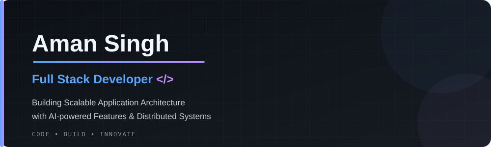

<div align="center">

<a href="https://github.com/Aman5ingh19">
  
</a>


<br/>


<br/><br/>

<a href="https://aman-portpolio.vercel.app/"></a>
<a href="https://linkedin.com/in/aman-singh-533519301"></a>
<a href="mailto:amansingh1992002@gmail.com"></a>
<a href="https://github.com/Aman5ingh19"></a>

<br/><br/>


</div>

---

## About Me

I'm **Aman Singh**, a Computer Science student  at **K.R. Mangalam University**, graduating in 2027. I enjoy engineering reliable, scalable applications that combine modern web technologies, intelligent automation, and practical problem-solving.

My approach to software development goes beyond writing code. I focus on understanding the problem, designing maintainable architectures, building intuitive user experiences, and delivering solutions that are secure, efficient, and useful.

My interests span **Full Stack Development, AI/ML Integration, Distributed Systems, Backend Engineering, and Cloud-Native Technologies**.

- **Software Engineering:** Building modular applications with clean architecture, RESTful APIs, authentication, and efficient data management.
- **AI & Machine Learning:** Exploring intelligent applications, LLM integrations, semantic retrieval, and applied machine learning. My research paper, *Phishing Detection in Email using Deep Learning*, reflects my interest in applying AI to practical security challenges.
- **Full Stack Development:** Developing end-to-end products using React, Next.js, Node.js, Django, PostgreSQL, and MongoDB.
- **Distributed Systems:** Exploring event-driven architectures, asynchronous processing, message queues, caching, and real-time communication through projects such as FixIt.
- **Product Engineering:** Prioritizing maintainability, user experience, reliability, and solving real-world problems over unnecessary complexity.
- **Continuous Learning:** Strengthening my foundations in software engineering while exploring modern development and deployment practices.

### Open To

- Full Stack Developer Internships
- Software Development Engineer (SDE) — Entry Level
- Backend Development Opportunities
- Collaborative Open Source Projects
- Learning and exploring Software Testing

---

## Tech Stack

Technologies I use in my projects and tools I am actively exploring.

### Languages

<p>

</p>

### Frontend

<p>

</p>

### Backend & Databases

<p>

</p>

### Cloud, DevOps & Tooling

<p>

</p>

<p>


</p>

**Currently expanding my knowledge of:** TypeScript, Docker, Kubernetes, Jenkins, System Design, Data Structures & Algorithms, and software testing practices.

---

## Featured Projects

A selection of projects demonstrating my work across full-stack development, AI integration, backend engineering, and distributed systems.

<details open>
<summary><b>01. FixIt — Distributed Service Booking & Repair Platform</b></summary>

<br/>

<div align="center">

<a href="https://fix-it-nu-sable.vercel.app/"></a>
<a href="https://github.com/Aman5ingh19/FixIt"></a>

</div>

**Overview**

FixIt is a full-stack service booking and repair platform designed to connect customers with technicians across categories such as electrical work, plumbing, HVAC, carpentry, electronics, and home appliances.

The application focuses on reliable booking workflows, real-time communication, and asynchronous event processing while providing a structured experience for customers and service providers.

| Dimension | Implementation |
|:---|:---|
| **Stack** | React, Node.js, Express.js, PostgreSQL, Prisma, Redis, Socket.IO |
| **Scale** | Modular full-stack architecture with asynchronous event processing |
| **Performance** | Redis caching, pagination, optimized API workflows, and real-time updates |
| **Security** | JWT authentication, OAuth 2.0/OIDC, validation, and secure payment workflow design |
| **Impact** | Streamlines service discovery, booking, job tracking, and technician communication |
| **Repository** | https://github.com/Aman5ingh19/FixIt |

**Engineering Highlights**

- Built customer and technician workflows for service requests, job management, and booking updates.
- Integrated Socket.IO for real-time communication and status updates.
- Implemented event-driven processing using Apache Kafka and RabbitMQ.
- Explored reliable message handling through retries and Dead Letter Queues (DLQ).
- Integrated Redis for caching and improved data access efficiency.
- Implemented authentication and authorization workflows.
- Integrated Razorpay Test Mode for payment workflow development.
- Used Docker, Kubernetes, and GitHub Actions in the deployment workflow.

**Core Engineering Focus:** Event-driven architecture, real-time systems, API design, authentication, and distributed application workflows.

</details>

<details open>
<summary><b>02. MailGenius — AI-Powered Email Assistant & Intelligence Platform</b></summary>

<br/>

<div align="center">

<a href="https://mail-genius-ai-email-assistant.vercel.app/"></a>
<a href="https://github.com/Aman5ingh19/MailGenius---AI-Email-Assistant"></a>

</div>

**Overview**

MailGenius is an AI-powered email assistant designed to simplify professional communication through intelligent reply generation, draft improvement, grammar correction, and tone analysis.

The platform combines multiple LLM providers with a retrieval-augmented generation architecture to support flexible AI workflows and contextual email assistance.

| Dimension | Implementation |
|:---|:---|
| **Stack** | Next.js, React, Supabase, PostgreSQL, pgvector, Gemini, Groq, OpenRouter |
| **Scale** | Multi-provider AI architecture with modular generation and retrieval workflows |
| **Performance** | Provider fallback, semantic retrieval, and Redis-based rate limiting |
| **Security** | Authentication, controlled API access, and rate-limited AI requests |
| **Impact** | Simplifies email drafting and improves professional communication workflows |
| **Repository** | [Aman5ingh19/MailGenius](https://github.com/Aman5ingh19/MailGenius---AI-Email-Assistant) |

**Engineering Highlights**

- Developed AI-assisted email generation, reply improvement, and tone analysis.
- Integrated Gemini, Groq, and OpenRouter with automatic provider fallback.
- Implemented RAG-based semantic retrieval using Supabase pgvector.
- Used PostgreSQL for structured application data and vector-based retrieval.
- Integrated authentication and Redis-based rate limiting.
- Added Firebase Cloud Messaging for push notification workflows.
- Containerized the application using Docker.

**Core Engineering Focus:** LLM orchestration, RAG, vector databases, fallback architecture, and AI-powered product engineering.

</details>

<details open>
<summary><b>03. HRMS Lite — Human Resource Management System</b></summary>

<br/>

<div align="center">

<a href="https://hrms-lite-ten-phi.vercel.app/"></a>
<a href="https://github.com/Aman5ingh19/HRMS-LITE"></a>

</div>

**Overview**

HRMS Lite is a human resource management application designed to simplify employee administration, attendance tracking, and daily HR workflows.

Built with React and Django, the platform combines structured backend services with authentication, caching, and workflow automation.

| Dimension | Implementation |
|:---|:---|
| **Stack** | React, Django, Django REST Framework, MongoDB Atlas, Redis, Clerk |
| **Scale** | Modular frontend and backend architecture with automated workflows |
| **Performance** | Redis caching and structured API communication |
| **Security** | Clerk authentication, controlled access, and backend validation |
| **Impact** | Simplifies employee record management, attendance, and HR operations |
| **Repository** | https://github.com/Aman5ingh19/HRMS-LITE |

**Engineering Highlights**

- Developed employee record management and attendance tracking workflows.
- Implemented check-in/check-out functionality.
- Built REST APIs using Django REST Framework.
- Integrated Clerk authentication.
- Explored event-driven processing with Kafka and RabbitMQ.
- Used Redis for caching and n8n for workflow automation.
- Containerized services and configured deployment workflows using Docker and Kubernetes.

**Core Engineering Focus:** Backend development, API integration, authentication, workflow automation, and cloud-native application design.

</details>

---

## Experience

### Full Stack Developer Intern — IBM Partnership Program

**June 2025 – July 2025**

Completed a full-stack development internship through the IBM Partnership Program, gaining practical experience in web application development, backend functionality, and API integration.

**Scope of Work**

- Developed full-stack web applications using MERN technologies.
- Built and integrated REST APIs to connect frontend interfaces with backend services.
- Processed structured data and implemented backend functionality for application workflows.
- Strengthened understanding of frontend-backend communication and application development practices.

**Skills & Technologies**

`MongoDB` `Express.js` `React` `Node.js` `REST APIs` `Full Stack Development`

---

## Achievements

<div align="center">

| Recognition | Details |
|:---|:---|
| **Research Publication** | Published *Phishing Detection in Email using Deep Learning* in IJMSRT (2025). |
| **Full Stack Development** | Completed a Full Stack Developer Internship through the IBM Partnership Program (2025). |
| **Project Engineering** | Developed full-stack applications integrating AI, backend services, real-time communication, and event-driven workflows. |
| **Continuous Learning** | Actively expanding knowledge in distributed systems, cloud-native engineering, and software development practices. |

</div>

---

## Certifications & Research Publication

<div align="center">

<a href="https://ijmsrt.com/">
  
</a>

**Phishing Detection in Email using Deep Learning**  
*International Journal of Modern Science and Research Technology (IJMSRT) — 2025*

<br/><br/>

<a href="https://infyspringboard.onwingspan.com/">
  
</a>

**Database and SQL — Infosys Springboard**  
*April 2025*

<br/><br/>

<a href="https://cognitiveclass.ai/">
  
</a>

**NoSQL and DBaaS 101 — IBM / Cognitive Class**  
*July 2025*

</div>

</div>

---

## GitHub Analytics

<div align="center">

<a href="https://github.com/Aman5ingh19">
  
</a>
<a href="https://github.com/Aman5ingh19">
  
</a>

<br/><br/>

<a href="https://git.io/streak-stats">
  
</a>

</div>

---

## GitHub Trophies & Milestones

<div align="center">

| Milestone | Description |
|:---|:---|
| **Open Source** | Exploring collaborative development through GitHub. |
| **Project Building** | Developing and maintaining full-stack applications. |
| **Continuous Learning** | Practicing DSA, backend engineering, and DevOps. |
| **Research** | Published research in email phishing detection. |
| **AI Engineering** | Exploring LLM integration, RAG, and semantic retrieval. |
| **Distributed Systems** | Building projects with event-driven workflows and messaging systems. |

</div>

---


## Contribution Snake

<div align="center">


</div>

---

## Current Focus

```yaml
name: Aman Singh
role: Full Stack Developer
graduation: 2027

learning:
  - TypeScript
  - Docker and Containerization
  - Kubernetes
  - Jenkins and CI/CD
  - System Design
  - Data Structures and Algorithms
  - Software Testing Practices

building:
  - FixIt: Distributed Service Booking Platform
  - MailGenius: AI-Powered Email Assistant
  - HRMS Lite: Human Resource Management System

exploring:
  - AI Engineering and RAG
  - Distributed Systems
  - Event-Driven Architecture
  - Cloud-Native Development
  - Backend Engineering
  - Software Quality and Reliability

open_to:
  - Full Stack Developer Internships
  - Entry-Level SDE Opportunities
  - Backend Development Roles
  - Open Source Collaboration
  - Learning and Exploring Software Testing

philosophy: "Build, Learn, Improve, Repeat."
```

---

## Connect With Me

<div align="center">

I'm always open to meaningful conversations, technical collaboration, and opportunities to learn and grow as a software engineer.

<br/>

<a href="mailto:amansingh1992002@gmail.com"></a>

<a href="https://linkedin.com/in/aman-singh-533519301"></a>

<a href="https://github.com/Aman5ingh19"></a>

<a href="https://aman-portpolio.vercel.app/"></a>

<br/><br/>

**Email:** [amansingh1992002@gmail.com](mailto:amansingh1992002@gmail.com)

**Portfolio:** [aman-portpolio.vercel.app](https://aman-portpolio.vercel.app/)

**LinkedIn:** [linkedin.com/in/aman-singh-533519301](https://linkedin.com/in/aman-singh-533519301)

</div>

---

<div align="center">

### Engineering is a journey of continuous learning, thoughtful design, and meaningful impact.

<br/>

<sub>Designed with purpose. Built with curiosity. Driven by engineering.</sub>

<br/><br/>


</div>
